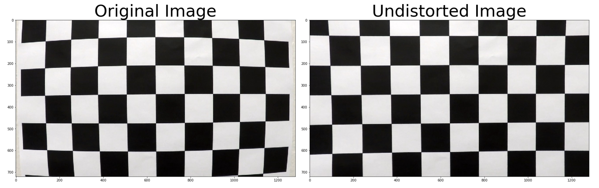
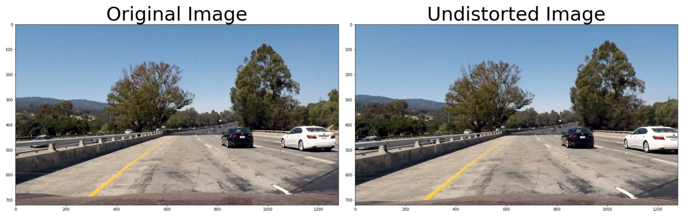
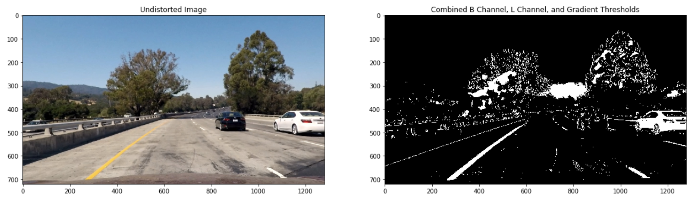
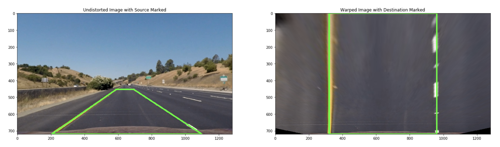
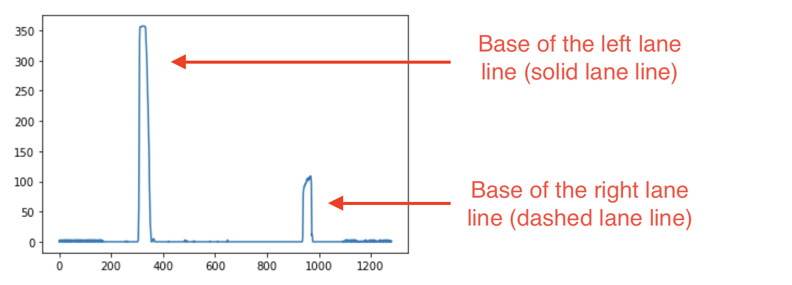
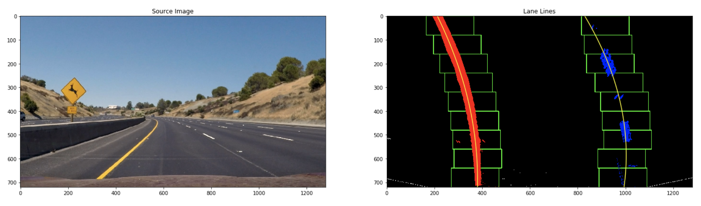
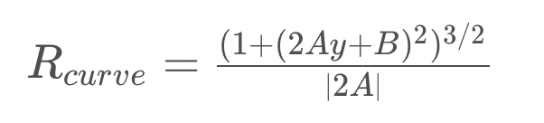
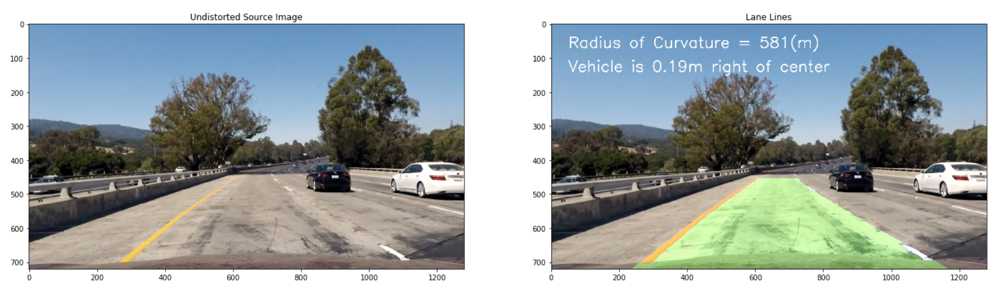

# Advanced Lane Finding
## Writeup

**All referenced source code is from the Jupyter notebook in this repostitory P2.ipynb**

**This project followed these steps:**
* Compute the camera calibration matrix and distortion coefficients given a set of chessboard images.
* Apply a distortion correction to raw images.
* Use color transforms, gradients, etc., to create a thresholded binary image.
* Apply a perspective transform to rectify binary image ("birds-eye view").
* Detect lane pixels and fit to find the lane boundary.
* Determine the curvature of the lane and vehicle position with respect to center.
* Warp the detected lane boundaries back onto the original image.
* Output visual display of the lane boundaries and numerical estimation of lane curvature and vehicle position.

**Link to [Project Rubric](https://review.udacity.com/#!/rubrics/571/view)**

---

### Camera Calibration

#### 1. Briefly state how you computed the camera matrix and distortion coefficients. Provide an example of a distortion corrected calibration image.

The code for my camera calibration and distortion correction is in the Jupyter notebook cells titled "Supporting Functions" and "Compute Calibration and Undistort Image". The  `calibrate` function was created for this purpose.

In  `camera_cal` there are several images of a 9 by 6 chessboard that we will use to calibrate the camera. I defined the  `calibrate` function that takes as parameters the  `camera_cal/` directory path as well as the 9 by 6 dimensions of the chessboard.

```
calibrate('camera_cal/', 9, 6)
```

This function defines an array of 9x6=54 (x,y,z) coordinates. We have an array of object points which will cycle from (0,0,0) to (8,5,0) representing the coordinates of the chessboard corners in the real world. (z is always 0 because the chessboard is flat.) For each chessboard image we will also use  `cv2.findChessboardCorners` to find the (x,y,z) coordinates of the same corners. These image points will be paired with the earlier object points.

The `calibrate` outputs `objpoints` and `imgpoints` will be used as parameters for `cv2.calibrateCamera()` to calculate the calibration coefficients `mtx` and `dist`. These coefficients are passed into  `cv2.undistort()` along with a test chessboard image to obtain the undistorted chessboard.



### Pipeline (single images)

#### 1. Provide an example of a distortion-corrected image.

The distortion-correction method outlined above was condensed into the `undistort` function in the "Supporting Functions" cell. Applying  this function to our lane images produces the following:



#### 2. Describe how (and identify where in your code) you used color transforms, gradients or other methods to create a thresholded binary image.  Provide an example of a binary image result.

I used three different methods to produce a combined thresholded binary image. The following functions are defined in the "Supporting Functions" cell.
1. `b_threshold` generates a threshold using B values from the LAB color space to isolate yellow lane lines.
2. `l_threshold` generates a threshold using L values from the HLS color space to isolate white lane lines.
3. `sx_threshold` generates a threshold using Sobel X gradient values to isolate edges.

When these three thresholds are combined we obtain the following result:



#### 3. Describe how (and identify where in your code) you performed a perspective transform and provide an example of a transformed image.

The "Apply Perspective Transform" cell in the Jupyter notebook contains my code for transforming images. The key to transforming images is defining a pairs of source and destination points. The following pairs were used in my code:

Point | Source (trapezoid-ish) | Destination (square)
------------ | ------------- | -------------
Top left | (Horizontal midpoint - 50px, 63% down from the top) | (25% from the left, top of the image)
Bottom left | (16% from the left, bottom of the image) | (25% from the left, bottom of the image)
Bottom right | (14% from the right, bottom of the image) | (25% from the right, bottom of the image)
Top right | (Horizontal midpoint + 53px, 63% down from the top) | (25% from the right, top of the image)

Using these defined points as parameters, I called `cv2.getPerspectiveTransform(src, dst)` to obtain the transformation matrix that I needed. Then I passed my image and the transformation matrix into `cv2.warpPerspective` to get my transformed image.



#### 4. Describe how (and identify where in your code) you identified lane-line pixels and fit their positions with a polynomial?

I used the sliding windows technique to identify where the lane-line pixels are. To start, I plotted a histogram chart that measured the density of activated/non-zero pixels for each x-coordinate of the transformed image. The thinking here is that a straight lane line would appear vertical in the transformed image and so there would be a very high density of non-zero pixels at the x-coordinate where the lane line is. Even for curved lane lines, the majority of the activated pixels originate near a single x-value.

The histogram should show two peaks: one for the base of the left lane line and a second peak for the base of the right lane line.



After identiying the lane line base x-coordinates, starting from that coordinate I could start to identify the exact pixels composing each lane line. I searched for pixels that fit within a certain boundary of the origin. The boundaries were drawn as rectangles that follow the lane pixels from the bottom to the top of the image.

Number of Rectangles | Rectangle Width | Rectangle Height | Position of First Left Rectangle | Position of First Right Rectangle
------------ | ------------- | ------------- | ------------- | -------------
9 | 200 | (Image Height / 9) | (X-coordinate of left histogram peak, 0) | (X-coordinate of right histogram peak, 0)

As the rectangles are drawn onto the transformed image, I collected all the pixels within the rectangle bounds and saved them as pixels belonging to the left or right lane line.

Before moving into the next rectangle up, I checked if we needed to re-center the next rectangle. For lanes that are curved the lane pixels tend to be more spread out. In this case we would find a higher density of lane pixels within the current rectangle. I defined a threshold value `minpix = 50` where if we exceed that number of identified pixels then I would recenter the next rectangle. To recenter the next rectangle I took the mean x-value of the pixels in the current window and locked that as the starting x-value of the next rectangle.

The outcome of iterating through each rectangle and storing the activated pixels each time is a collection of all left and right lane pixel coordinates. Using `np.polyfit()` with the (x, y) pixel coordinates of each lane, I was able to back into a polynomial fit for the f(y) function that defined the lane.



#### 5. Describe how (and identify where in your code) you calculated the radius of curvature of the lane and the position of the vehicle with respect to center.

The Jupyter cell block titled "Determine Lane Curvature and Vehicle Position" contains my calculations for the radius of curvature and lane positioning. After obtaining the polynomial fit for each lane line, I had the lane lines mapped as functions that looked like the `f(y) = Ay^2 + By + C` where `fit[0] = A`, `fit[1] = B`, and `fit[2] = C`.

With that I was able to use the following formula to calculate lane curvature:


One more step was necessary to obtain the curvature in meters instead of pixels. I used the following multipliers and placed them in the above formula using the code displayed under the table.

Meters-per-pixel multiplier (x-direction) | Meters-per-pixel multiplier (y-direction)
------------ | ------------- 
3.7/700 | 30/720

```
curverad = ((1+(2*fit[0]*y_eval*ym_per_pix+fit[1])**2)**(3/2))/abs(2*fit[0])
```

Then to obtain the position of the vehicle, I used my polynomial fits to calculate the x-positions of the left and right lane edges at a value of `y=0`. This provided me with `x_left` and `x_right`. I then took the midpoint of these two coordinates to find the actual position of my vehicle in the lane: `x_midpoint_act`.

I compared this value to `x_midpoint_exp`, defined as the expected midpoint of the lane at the center of the image. The difference between these values (converted to meters with the above multipliers) is the position of the vehicle.

#### 6. Provide an example image of your result plotted back down onto the road such that the lane area is identified clearly.

The Jupyter notebook cell titled "Draw the Lane Back onto the Original Image" contains the code for this section. I used the inverse transform matrix to untransform my birds-eye view of the lane and map it back to the original lane view. Then I plotted the lane pixels back onto the source image.



---
# Example writeup
---


---

### Pipeline (video)

#### 1. Provide a link to your final video output.  Your pipeline should perform reasonably well on the entire project video (wobbly lines are ok but no catastrophic failures that would cause the car to drive off the road!).

Here's a [link to my video result](./project_video.mp4)

---

### Discussion

#### 1. Briefly discuss any problems / issues you faced in your implementation of this project.  Where will your pipeline likely fail?  What could you do to make it more robust?

Here I'll talk about the approach I took, what techniques I used, what worked and why, where the pipeline might fail and how I might improve it if I were going to pursue this project further.  
